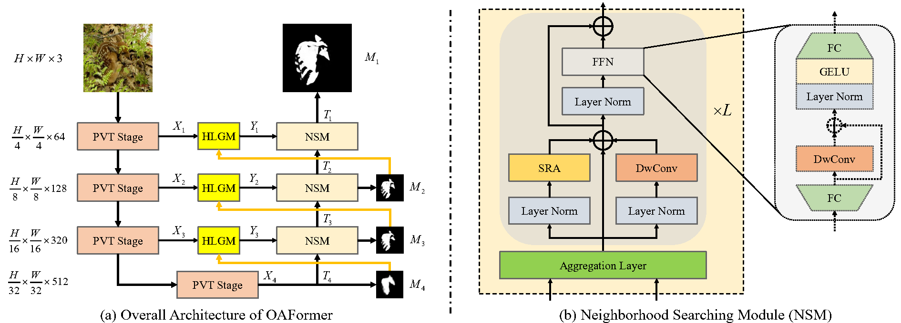

# <p align=center>`OAFormer: Occlusion Aware Transformer for Camouflaged Object Detection`</p>

code will be released soon!!!

> **Authors:**
> [Xin Yang](https://github.com/xinyang920),
> Hengliang Zhu,
> Guojun Mao,
> [Shuli Xing](https://github.com/xingshulicc)


This official repository contains the source code, prediction results, and evaluation toolbox of paper 'OAFormer: Occlusion Aware Transformer for Camouflaged Object Detection'. The technical report could be found at [arXiv](https://arxiv.org/abs/). 
The whole benchmark results can be found at [One Drive](), [Baidu Netdisk](), or [Google Drive]().


<p align="center">
     <br />
    <em> 
    Figure 1: The overall architecture of the proposed occlusion aware transformer network. In part (a), we present the overall architecture of OAFormer. Part (b) displays the internal structures of the proposed neighborhood searching module (NSM).
    </em>
</p>


## 1. Code

**1.1. Requirements**

```
Python 3.7
Pytorch 1.13.0
OpenCV 4.6.0.66
Timm 0.6.11
Numpy 1.23.4
Tqdm 4.64.1
TensorboardX 2.5.1
Apex 0.1
```


**1.2. Download Datasets and Checkpoints.**

- **Datasets:** 

By default, you can put datasets into the folder 'dataset'.

- **Checkpoints:** 

By default, you can put datasets into the folder 'checkpoint'.

OAFormer: [Google Drive]()
Backbone: [Google Drive]()

**1.3. Train.**
```
python train.py
```
**1.4. Test.**
```
python test.py
```

**1.5. Eval.**
```
python eval.py
```


## 2. Proposed OAFormer

### 2.1 COD Benchmark Results:

The prediction of our OAFormer can be found in [Google Drive](). Here are quantitative performance comparison.

<p align="center">
     <br />
    <em> 
    </em>

</p>


## Acknowlegement
Thanks [Zhirui Zhao](https://github.com/zhaozhirui) providing a friendly [codebase](https://github.com/zhaozhirui/CTDNet) for binary segmentation tasks. And our code is built based on it. 


## Reference
You may want to cite:
```
coming soon!
```

### License

Code in this repo is for non-commercial use only.


